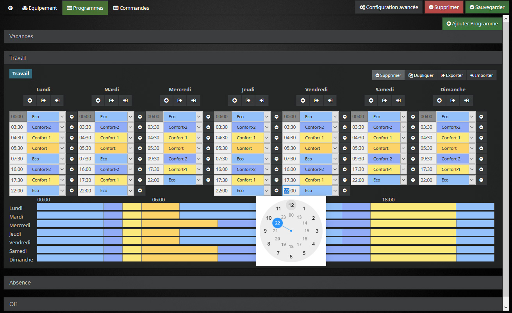
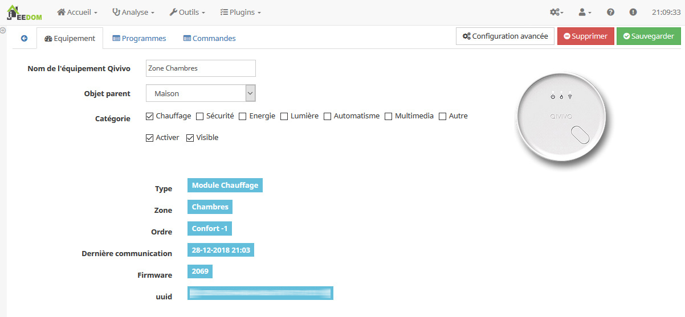
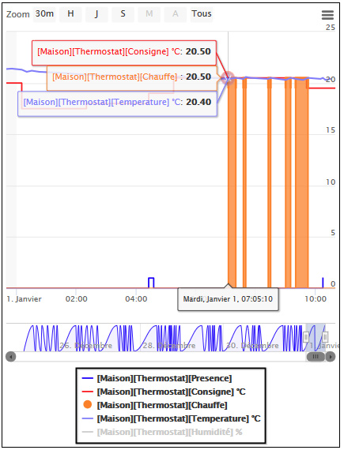
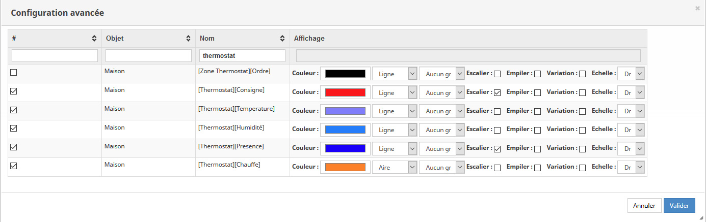

# Qivivo - Plugin pour Jeedom

Intégration du Thermostat Qivivo.

[Pré-requis](#pré-requis)<br />
[Configuration](#configuration)<br />
[Utilisation](#utilisation)<br />
[Actions](#actions)<br />
[Programmes](#programmes)<br />
[Historique](#historique)<br />
[Remarques](#remarques)<br />
[Changelog](#changelog)<br />


## Pré-requis
Ce plugin repose en partie sur l'API officielle Qivivo, vous devez donc créer un accès (gratuit) sur cette API, puis récupérer vos Client ID et Secret ID.
[account.qivivo.com](https://account.qivivo.com/)


## Configuration

Après installation, activez le plugin. Il apparaitra alors dans le menu *Plugins > Confort*.
- Ouvrez la page du plugin, puis cliquez sur *Configuration*.
- Renseignez vos Login, password Qivivo, et vos Client ID et Secret ID.
- Cliquez sur *Synchroniser mes équipements*.

<p align="center">
  
</p>

Ceci aura pour effet d'installer votre thermostat, la passerelle (qui n'a ici aucune fonction), et vos modules fil-pilote, nommés par zone.
Il ne reste qu'à rafraichir la page du plugin (F5) !

<p align="center">
  
</p>


## Utilisation

Renseignez pour chaque module, son nom et son Objet parent si nécessaire. Ils apparaitrons ainsi au bon endroit sur votre dashboard.

### Dashboard
Voici un exemple sur le dashboard:

<p align="center">
  
</p>
Vous pouvez ainsi visualiser:

- La température de consigne du thermostat
- La température mesurée par le thermostat
- Le taux d'humidité mesuré par le thermostat
- Si le thermostat relève une présence
- La dernière présence relevée par le thermostat
- L'ordre en cours par zone
- Le programme en cours par zone
- La date de dernière communication du module avec les serveurs Qivivo

> Quand vous changez la consigne du thermostat, l'affichage change sur le dashboard. Toutefois, la commande info de consigne n'est volontairement pas mise à jour. En effet, les programmes temporaires ne sont pas pris en compte immédiatement par Qivivo, cela peu prendre entre 1 et 5mins. De cette façon, l'historique de la consigne enregistrera les vraies valeurs de consigne du thermostat et sera mise à jour lors de la prise en compte par celui-ci. 
> Idéalement, il faudrait pouvoir savoir si un programme temporaire est en cours, mais l'API Qivivo ne remonte pas cette info. A voir dans le futur.

Vous pouvez également:

- Changer la température de consigne (pendant 2h) du thermostat
- Annuler une programmation temporaire du thermostat
- Changer l'ordre d'une zone
- Changer le programme d'une zone

Vous pouvez bien sûr intégrer ces informations et actions dans des scénarios !

## Actions

Le thermostat dispose de plusieurs actions que vous pouvez intégrer normalement dans Jeedom, dans les scénarios par exemple.

<p align="center">
  
</p>

>La commande SetTempérature permet de lancer un programme temporaire, de la même manière que par le site Qivivo ou physiquement sur le thermostat. Le thermostat dispose dans Jeedom d'une info *DuréeOrdre* qui sera la durée du programme temporaire. Celle-ci se remet à 120mins (comme pour le thermostat physique) toutes les 15mins (ou 5mins si vous activez le cron5). Toutefois, si vous souhaitez spécifier une autre durée, lancer une commande *SetDuréeOrdre* avant la commande *SetTempérature*.
Vous pouvez également annuler un programme temporaire avec la commande *Annule_Ordre_Temp*.

Les modules de zone disposent également de leurs actions *SetMode* pour changer d'ordre, et *SetProgramme* pour appliquer un programme que vous aurez créé auparavant.
> Le module de la Zone Thermostat ne possède pas la commande *SetMode* puisqu'il est contrôlé par la consigne du thermostat.

## Programmes
<p align="center">
  
</p>

Sur chaque module, y compris celui de la zone thermostat, vous trouverez un onglet *Programmes*. Vous pourrez y créer plusieurs programmes, pour pouvoir en changer, depuis le dashboard ou depuis un scénario.

> Sur chaque jour, vous pouvez bien sûr créer des périodes de chauffe, mais aussi copier un jour entier pour le coller ailleurs, y compris sur un autre programme.

Une fois vos programmes crées et votre équipement sauvegardé, la liste de vos programmes apparaitra sur le widget de zone sur votre dashboard, et dans la liste proposée sur l'action *SetProgramme* dans vos scénarios.

Vous pouvez également exporter chaque programme (un fichier json correspondant sera crée dans plugins/qivivo/exportedPrograms), pour pouvoir ensuite l'importer dans un autre programme.

## Equipements

### Thermostat

<p align="center">
  
</p>

Certaines informations sont visibles ici, notamment les réglages de température. Ce sont les mêmes que dans les réglages sur le site de Qivivo.

### Module fil-pilote

<p align="center">
  
</p>

Le module fil-pilote possède une info *Ordre* affichant l'ordre courant sous forme lisible (*string*). Cette info n'est pas historisée, mais une autre info *OrdreNum* représente l'ordre sous forme de numéro de 1 à 6, et est historisée :

- Arrêt : 1
- Hors-Gel : 2
- Eco : 3
- Confort -2 : 4
- Confort -1 : 5
- Confort : 6

## Historique

Comme pour toutes les commandes dans Jeedom, vous pouvez bien sûr consulter l'historique de celles-ci et ainsi avoir une synthèse quotidienne, que Qivivo ne propose plus aux nouveaux clients depuis plus d'un an.

<p align="center">
  
</p>

>Les commandes suivantes sont créees par défaut sans mode de lissage, en conservant les valeurs pendant 1an:
>- Thermostat Consigne
>- Thermostat Temperature
>- Thermostat Humidité
>- Thermostat Presence
>- Thermostat Chauffe
>- Module Chauffage OrdreNum

Vous pouvez également ajouter un *Graphique* sur un Design pour avoir la synthèse pré-configurée. Une fois le graphique créé sur le design, faites un clic droit dessus puis *Configuration avancée* pour choisir vos courbes et paramètres.

Exemple:
<p align="center">
  
</p>

> Vous pouvez bien sûr y ajouter d'autres courbes d'autres capteurs de températures, etc.

## Remarques

### Fonctionnement
- L'ensemble des fonctions du thermostat (changement de consigne, récupération des informations) repose sur l'API Qivivo.
- L'API Qivivo ne gérant pas encore le multi-zone, toutes les fonctions de changement d'ordre et de programme par zone/module repose sur une [API développée début 2018](https://github.com/KiboOst/php-qivivoAPI).
- Ce plugin n'utilise aucune dépendances et n'installe donc rien sur votre système en dehors de ses propres fichiers dans html/plugins/qivivo.

*Le but à terme est de basculer entièrement sur l'API officielle, quand celle-ci proposera l'ensemble des fonctions dont le plugin a besoin.*

### Gestion des erreurs
Il peux arriver que les serveurs de Qivivo ne répondent pas:

Lors d'un rafraichissement des informations, si l'appel à l'API Qivivo échoue trois fois de suite, un log d'erreur sera créé.

Lorsque vous passez une commande (une action), par un widget ou un scénario, un échec peut-être très embêtant. Si vous quittez la maison pendant une semaine et qu'un scénario passe votre Qivivo en programme absence, le risque est que le chauffage reste allumé toute la semaine.

Dans ce cas, vous avez deux possibilités, dans la configuration du plugin:

- ***Répéter l'action sur échec*** : le plugin répétera la même action 90sec plus tard en utilisant le système de cron de Jeedom. Lors de ce 2èm appel, si la commande échoue à nouveau (ou si vous décochez l'option), un log d'erreur est créé (et un message si l'option est cochée dans la configuration de Jeedom).
-  ***Actions sur erreur***: Vous pouvez définir ici des actions à exécuter si une commande ne passe pas. Par exemple, vous envoyer un email, une notification sur l'application mobile, etc. Vous pouvez spécifier dans un champ *Message* le raccourci #message# pour obtenir une description de la commande ayant échouée.

### Auto actualisation

Dans la page de configuration, onglet *Fonctionnalités*, l'option cron15 est activée par défaut. Ceci permet d'actualiser toutes les infos des modules et du thermostat toutes les 15mins. Au regard de la réactivité du chauffage, c'est suffisant.
Toutefois, l'actualisation des données sur les serveurs Qivivo se faisant toutes les 5 minutes, vous pouvez si vous le souhaitez passer le cron à 5mins.

### Eté / Hiver

A l'arrêt du chauffage, vous pouvez basculer le plugin en cron15 (voir même désactiver les cron) par un scénario, avec un bloc code:

```
config::save('functionality::cron5::enable', 0, 'qivivo');
config::save('functionality::cron15::enable', 1, 'qivivo');
```

Personnellement, j'ai un programme *Off* sur chaque zone, en Arrêt et Hors-Gel. Avec un *Mode* je passe la maison en *Travail*, *Vacances* ou *Absence*, qui ajuste le programme de chauffage en fonction. J'ai ensuite deux variables pour les dates de début et fin de chauffage, et en fonction, un scénario change le programme en *Off*, change le cron du plugin, et affiche ou masque les équipements sur le dashboard.

### Debug

Si vous rencontrez des problèmes, l'équipement *passerelle* possède une commande *debug*. Vous pouvez cliquer sur *Tester*, ce qui générera un log qivivo_debug. Vous pouvez envoyer à kiboost->free.fr (ou mp sur le forum Jeedom) avec:
- La description du problème.
- Une description de votre installation Qivivo avec si possible des screens du site Qivivo.
- Si vous êtes familier du plugin outildev, pour pouvoir vous envoyer des correctifs de test.


## Changelog

[Voir la page dédiée](changelog.md).


