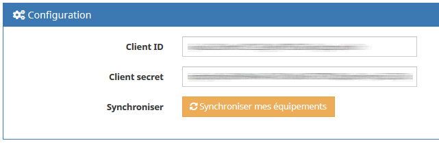
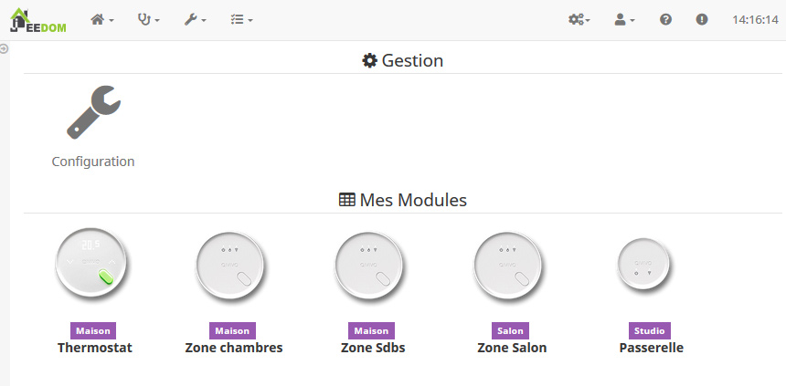
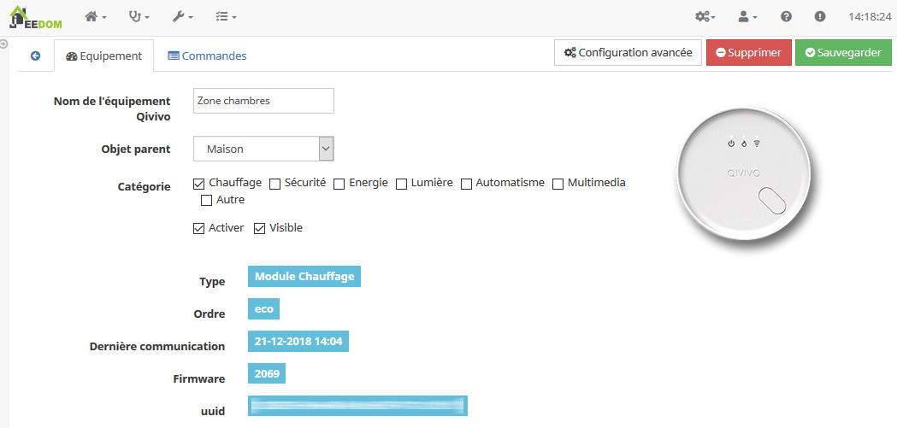
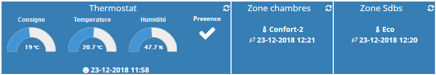
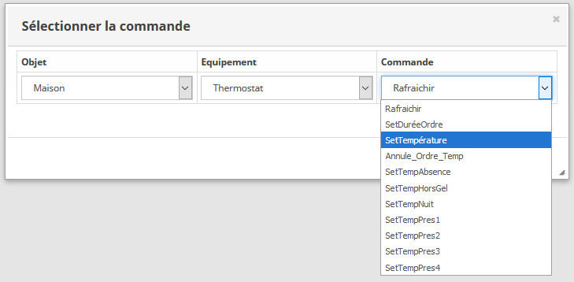

# Qivivo - Plugin pour Jeedom

Intégration du Thermostat Qivivo.

## Pré-requis
Ce plugin repose sur l'API officielle Qivivo, vous devez donc créer un accès (gratuit) sur cette API puis récupérer vos Client ID et Secret ID.
[https://account.qivivo.com/](https://account.qivivo.com/)

## Limitations
L'API Qivivo ne gère toujours pas les configurations multizone. Vous pourrez toutefois utiliser ce plugin pour voir les ordres des modules de vos zones, et avoir accès aux fonctions du thermostat.

## Configuration du plugin Qivivo

Après installation du plugin, il vous suffit de l’activer.
Il apparaitra alors dans le menu *Plugins > Confort*.
La première chose à faire est alors de cliquer sur *Configuration*, de renseigner vos Client ID et Secret ID, puis de cliquer sur *Synchroniser mes équipements*.

  

Ceci aura pour effet d'installer votre thermostat, la passerelle (qui n'a ici aucune fonction), et vos modules fil-pilote.
Il ne reste qu'à rafraichir la page du plugin !

  

### Auto actualisation
Dans la page de configuration, onglet *Fonctionnalités*, l'option cron15 est activée par défaut. Ceci permet d'actualiser toutes les infos des modules et du thermostat toutes les 15mins. Au regard de la réactivité du chauffage, c'est suffisant.
Toutefois, l'actualisation des données sur les serveurs Qivivo se faisant toutes les 5 minutes, vous pouvez si vous le souhaitez passer le cron à 5mins.

## Utilisation

Renseignez pour chaque module, son nom et son Objet parent. Ils apparaitrons ainsi au bon endroit sur votre dashboard.

### Thermostat

  

Certains informations sont visible ici, notamment les réglages de température. Ceci sont les même que dans les réglages sur le site de Qivivo.
Pour une question de place, ils ne sont pas affichés sur le dashboard. Vous pouvez toutefois les afficher en allant sur l'onglet *Commandes*. Vous pouvez également paramétrer le widget normalement, sous forme de tableau etc.

### Module fil-pilote

  

Le module fil-pilote possède une info *Ordre* affichant l'ordre courant sous forme de *string*. Cette info n'est pas historisée, mais une autre info *OrdreNum* représente l'ordre sous forme de numéro de 1 à 6, et est historisée :
off : 1
frost : 2
eco : 3
comfort_minus_two : 4
comfort_minus_one : 5
comfort : 6

Remarque: si vous êtes en multi-zone, l'un de vos module fil-pilote aura pour ordre *monozone [Zone Thermostat]*. C'est celui qui correspond à la zone thermostat, et il ne peux pas recevoir d'ordre.

### Dashboard
Voici un exemple sur le dashboard:

  

Vous pouvez visualiser ainsi:

- L'ordre en cours sur les modules fil-pilote
- La température de consigne du thermostat
- La température mesurée par le thermostat
- Le taux d'humidité mesuré par le thermostat
- Si le thermostat relève une présence
- La dernière présence relevée par le thermostat

Vous pouvez bien sûr intégrer ces informations dans des scénarios !

### Actions

Le thermostat dispose de plusieurs actions que vous pouvez intégrer normalement dans Jeedom, dans les scénarios par exemple.

  

Remarque:
La commande SetTempérature permet de lancer un programme temporaire, de la même manière que par le site Qivivo ou physiquement sur le thermostat. Le thermostat dispose dans Jeedom d'une info *DuréeOrdre* qui sera la durée du programme temporaire. Celle-ci se remet à 120mins (comme pour le thermostat physique) toutes les 15mins. Toutefois, si vous souhaitez spécifier une autre durée, lancer une commande *SetDuréeOrdre* avant la commande *SetTempérature*.
Vous pouvez également annuler un programme temporaire avec la commande *Annule_Ordre_Temp*.

Au lieu de lancer un programme temporaire, vous pouvez aussi laisser le programme en cours, mais changer les températures (Absence, Hors-Gel, Presence 1, 2, 3, 4 etc). Vous pouvez par exemple vérifier régulièrement la météo, l'ensoleillement etc et augmenter ou abaisser la température en cours.

## Changelog

[Voir la page dédiée](changelog.md).

